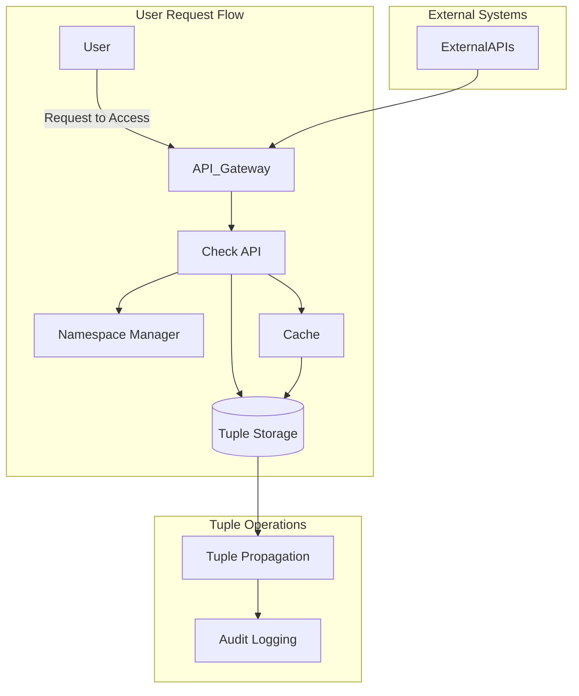

### Google Zanzibar: An Overview and Tuple Storage Design

Google Zanzibar is a highly scalable, distributed authorization system built to manage fine-grained access control for millions of users and objects. It powers authorization systems at a global scale, supporting complex relationships between users and resources, such as documents, files, or services. Zanzibar handles trillions of permission checks per day, providing the necessary architecture to answer questions like “Can user X perform action Y on object Z?” in milliseconds.

In this article, we’ll explore the architecture of Zanzibar, its key components, and, most importantly, delve deep into the **tuple storage** system that lies at the heart of Zanzibar’s functionality.

---

### Key Concepts of Google Zanzibar

**Zanzibar** is designed to handle the complex access control policies required by large-scale applications, such as hierarchical permissions, group memberships, and role-based access control (RBAC). The system is built to address the challenges of managing access control at scale, particularly in environments where:
- Users have varying levels of access to millions of objects.
- Access control policies evolve over time.
- Consistency, availability, and latency must be carefully balanced.

#### Key Goals:
1. **Fine-grained access control**: Support for complex relationships, such as hierarchical and group-based permissions.
2. **Scalability**: Able to manage billions of objects and handle millions of requests per second.
3. **Consistency**: Provides bounded staleness to balance consistency and performance in a global environment.
4. **Expressiveness**: Supports relationships like roles, groups, and hierarchies.
5. **Efficiency**: Efficiently manages access control with low-latency permission checks.

---

### Core Components of Zanzibar

1. **Object Namespace**:
   - Objects are grouped into namespaces (e.g., "files" or "folders") to organize resources logically. Each namespace has its own schema that defines applicable actions (like read or write) and relationships (like ownership).

2. **Tuples**:
   - **Tuples** represent relationships between users, objects, and actions. A tuple has three parts: the object (resource), the user (principal), and the permission (relation). For example: `(file123, canRead, user456)` indicates that `user456` has `canRead` access to `file123`.

3. **Check API**:
   - The **Check API** answers whether a user can perform a specific action on an object. It does this by querying tuples to see if the relationship exists or can be inferred (e.g., through group membership or hierarchical permissions).

4. **Expand API**:
   - The **Expand API** answers the reverse question: Who can perform a specific action on an object? It returns all users who have a given permission for an object, often used in auditing or sharing settings.

5. **Namespace Manager**:
   - Manages object namespaces and ensures consistent application of access control rules across different object types.

6. **Tuple Storage**:
   - The core component that stores user-object-permission relationships (tuples) in a distributed and scalable database. The next section explores this in detail.

---

### Tuple Storage in Zanzibar: The Heart of Access Control

#### 1. **What is a Tuple?**
A **tuple** in Zanzibar is the fundamental unit that describes an access control relationship:
```
(object, relation, user)
```
For example, `(file123, canRead, user456)` means that `user456` can read `file123`. Zanzibar leverages these tuples to manage permissions at scale.

#### 2. **Key Roles of Tuple Storage**:
Tuple Storage serves multiple roles in Zanzibar’s architecture:
- **Stores Access Control Policies**: All permission relationships between users and objects are stored as tuples.
- **Handles High Throughput**: It must manage billions of tuples and process millions of permission checks per second.
- **Provides Fast Access**: Tuples are indexed and sharded for low-latency access to support real-time authorization queries.
- **Supports Complex Relationships**: Tuple Storage can handle direct, hierarchical, and group-based relationships, as well as role-based access control (RBAC).

#### 3. **Structure of a Tuple**:
A tuple has the following components:
- **Object ID**: The object/resource being accessed.
- **Relation**: The permission being granted (e.g., "canRead").
- **User ID**: The user or service principal requesting access.
- **Namespace**: Groups similar objects (e.g., all files in a file storage system).
- **Timestamp** (optional): To support bounded staleness, each tuple can have a timestamp indicating when it was last updated.

#### 4. **Complex Relationships** in Tuple Storage:
Zanzibar supports several types of relationships beyond direct user-object permissions:
- **Hierarchical Permissions**: Permissions can be inherited through relationships between objects. For example, `canRead` access on a folder can apply to all files inside it.
- **Group Membership**: Users can be part of groups that have permissions, such as: `(group123, member, user456)` and `(doc789, canRead, group123)`.
- **Roles**: Roles imply multiple permissions (e.g., "editor" might imply both `canRead` and `canWrite`).

---

### Databases for Tuple Storage

Given the scale and complexity of Zanzibar’s tuple storage, several types of databases are suitable for implementing this kind of system. Here are some top choices:

#### 1. **Google Spanner** (Zanzibar’s Original Database):
   - **Features**: Spanner is a globally distributed SQL database offering ACID transactions and horizontal scaling.
   - **Why it works**: Spanner’s **strong consistency** and **global availability** are ideal for storing and querying billions of tuples.

#### 2. **CockroachDB**:
   - **Features**: A globally distributed database similar to Spanner, but open-source. It provides strong consistency and horizontal scaling.
   - **Why it works**: Its distributed architecture allows it to efficiently store and query access control tuples across global regions.

#### 3. **Cassandra** or **ScyllaDB**:
   - **Features**: NoSQL databases designed for large-scale, write-heavy applications, with tunable consistency and high throughput.
   - **Why it works**: Ideal for large-scale tuple storage, capable of handling massive writes and eventually consistent reads. ScyllaDB offers a more performant alternative to Cassandra.

#### 4. **DynamoDB**:
   - **Features**: Amazon's fully managed NoSQL database, supporting serverless scaling and low-latency reads/writes.
   - **Why it works**: DynamoDB’s flexibility and global tables make it a good choice for large-scale, low-latency tuple storage.

#### 5. **PostgreSQL** with **Citus**:
   - **Features**: Citus allows PostgreSQL to scale horizontally by distributing data across multiple nodes.
   - **Why it works**: PostgreSQL’s relational capabilities, combined with Citus for scale, provide a robust solution for handling tuple storage with transactional consistency.

#### 6. **Neo4j** (Graph Database):
   - **Features**: Neo4j is a graph database optimized for querying complex relationships.
   - **Why it works**: Ideal for managing complex relationships like group memberships and hierarchical permissions. Its native graph query capabilities simplify traversing permission trees.

#### 7. **FoundationDB**:
   - **Features**: A distributed, transactional key-value store with ACID compliance.
   - **Why it works**: FoundationDB’s strong consistency and ability to handle high-throughput writes make it a strong candidate for tuple storage.

---

### Key Considerations for Tuple Storage:

When selecting or designing tuple storage for a Zanzibar-like system, the following factors are critical:

1. **Scalability**: The database must handle billions of tuples and millions of permission checks per second.
2. **Consistency**: Depending on the use case, **strong consistency** or **bounded staleness** may be required. Google Spanner and CockroachDB offer strong consistency, while DynamoDB and Cassandra provide eventual consistency with tunable options.
3. **Low Latency**: The system must provide low-latency access to tuple data, especially for read-heavy workloads.
4. **Transactional Support**: Updates to group memberships, roles, and hierarchical permissions require atomic operations, making transactional databases like Spanner, CockroachDB, and PostgreSQL strong contenders.
5. **Relationship Handling**: The ability to efficiently manage complex relationships like hierarchies and groups is crucial. Databases like Neo4j, designed for graph traversal, excel at handling these.

---

### Conclusion

Google Zanzibar’s access control system is a masterclass in **fine-grained, scalable authorization**, powered by a distributed and efficient tuple storage mechanism. The tuple storage component is critical to supporting real-time access control checks across massive datasets. By selecting the right database backend—such as Google Spanner, CockroachDB, Cassandra, or DynamoDB—Zanzibar can manage billions of relationships while maintaining low-latency, high-throughput performance.

In building similar systems, understanding the trade-offs between consistency, performance, and scalability will help developers design tuple storage solutions that meet the needs of large-scale, distributed applications.





In Google Zanzibar’s **hierarchical permission model**, permissions can be inherited from parent objects. For instance, if a user has access to a parent folder, they should also inherit that same access to all files or subfolders within it. This is particularly useful in systems where resources are organized in a hierarchy, such as file systems (folders and files), document sharing platforms (projects and documents), or organizational units (departments and users).

The following is a detailed logic breakdown to retrieve permissions in such a hierarchical permission model.

---

### Example Scenario: Hierarchical Permissions

Assume the following hierarchy:

```
Folder A (parent)
   ├── Subfolder B
   └── File C
```

- If a user has `canRead` access to **Folder A**, they should inherit `canRead` access to **Subfolder B** and **File C**.
- **Folder A**, **Subfolder B**, and **File C** are related in a parent-child structure.

### Step-by-Step Logic for Checking Hierarchical Permissions

#### 1. **Define the Tuple Schema**
The relationships between objects are stored as tuples. For hierarchical permissions, you need two types of tuples:
- **Permission tuples**: Define the permissions for a user on a resource (e.g., `(FolderA, canRead, User1)`).
- **Hierarchy tuples**: Define the parent-child relationships between objects (e.g., `(FolderA, parentOf, SubfolderB)`).

#### Tuple Examples:
1. Permission tuple:
   ```
   (FolderA, canRead, User1)
   ```
   This tuple means that `User1` has `canRead` access to `FolderA`.

2. Hierarchical tuple:
   ```
   (FolderA, parentOf, SubfolderB)
   ```
   This tuple defines that `FolderA` is the parent of `SubfolderB`.

3. Hierarchical tuple:
   ```
   (SubfolderB, parentOf, FileC)
   ```
   This tuple defines that `SubfolderB` is the parent of `FileC`.

#### 2. **Recursive Query for Permissions**
The core idea is to **recursively traverse the hierarchy** from the target object (e.g., **File C**) to its parent (e.g., **Subfolder B**) and up to the root object (e.g., **Folder A**). If the user has permission at any level in the hierarchy, that permission is inherited downwards.

##### Algorithm Logic:

1. **Check Direct Permissions**:
   - Start by checking if the user has the required permission directly on the target object (e.g., **File C**).
   - Example query: Does `User1` have `canRead` on `FileC`?
     - If a tuple `(FileC, canRead, User1)` exists, the user has direct permission, and you can return `true`.

2. **Check Parent-Child Relationships**:
   - If the user does not have direct permission, check if the object has a parent.
   - Example query: Is `FileC` a child of another object?
     - Query the tuple `(SubfolderB, parentOf, FileC)`.
     - If this tuple exists, it indicates that **File C** is a child of **Subfolder B**.

3. **Recursive Permission Inheritance**:
   - If **File C** has a parent (e.g., **Subfolder B**), check if the user has the required permission on the parent object.
   - Example query: Does `User1` have `canRead` on `SubfolderB`?
     - If the tuple `(SubfolderB, canRead, User1)` exists, return `true`.
   - If **Subfolder B** does not grant the user permission, repeat the process and move to **Folder A** (the parent of **Subfolder B**).
   
4. **Root-Level Permissions**:
   - The process continues until either a permission is found or there are no more parents to check (reaching the top of the hierarchy).
   - Example query: Does `User1` have `canRead` on `FolderA`?

5. **Caching for Efficiency**:
   - This recursive traversal can be optimized by caching results for objects that have already been checked. For example, if you determine that **Folder A** grants `canRead` access to **User1**, you can cache this result and avoid querying the hierarchy again for other objects under **Folder A**.

#### Pseudocode

Here’s a simplified pseudocode to handle hierarchical permissions:

```python
def has_permission(user, object_id, permission):
    # Base case: Check if the user has direct permission on the object
    if check_direct_permission(object_id, permission, user):
        return True

    # Recursive case: Check the parent hierarchy
    parent = get_parent_object(object_id)
    
    if parent is None:
        return False  # No parent, so no inherited permission

    # Recursively check if the user has permission on the parent
    return has_permission(user, parent, permission)


def check_direct_permission(object_id, permission, user):
    # Query the tuple storage to check if (object_id, permission, user) exists
    return tuple_exists(object_id, permission, user)

def get_parent_object(object_id):
    # Query the tuple storage to get the parent of the object
    # Returns None if no parent exists
    return get_tuple_value(object_id, "parentOf")
```

#### Explanation:
- **check_direct_permission()**: Queries the tuple storage to check if the user has direct permission on the object.
- **get_parent_object()**: Queries the tuple storage to find the parent of the object.
- **has_permission()**: Recursively checks whether the user has permission either directly on the object or via inheritance from parent objects.

#### Example:

Suppose **User1** wants to read **FileC**. The following tuples are stored:

- `(FolderA, canRead, User1)` — User1 has `canRead` permission on FolderA.
- `(FolderA, parentOf, SubfolderB)` — SubfolderB is a child of FolderA.
- `(SubfolderB, parentOf, FileC)` — FileC is a child of SubfolderB.

Using the algorithm:
1. **Direct Check**: There’s no tuple `(FileC, canRead, User1)`, so User1 doesn’t have direct permission.
2. **Parent Check**: The parent of **FileC** is **SubfolderB**. There’s no tuple `(SubfolderB, canRead, User1)` either.
3. **Grandparent Check**: The parent of **SubfolderB** is **FolderA**, and there’s a tuple `(FolderA, canRead, User1)`, granting **User1** the required `canRead` permission on **FolderA**. Therefore, **User1** can also read **FileC** due to inheritance.

---

### Optimizations for Hierarchical Permission Checks

1. **Caching**: 
   - Use caching mechanisms to avoid redundant checks. If you’ve already verified that a parent grants permission, you can cache that result and apply it to all child objects.
   
2. **Batch Queries**:
   - Instead of querying parent-child relationships and permissions one at a time, batch queries can be used to fetch all relevant tuples in a single request.

3. **Precomputed Permissions**:
   - In cases where the hierarchy is mostly static, you can precompute permissions and store them directly in the tuple storage for faster access.

4. **Breadth-First Search (BFS)**:
   - Use a BFS approach to traverse the hierarchy level-by-level, starting from the target object. This allows you to check permissions at each level efficiently without deep recursion.

---

### Conclusion

Handling hierarchical permissions in a Zanzibar-like system involves traversing the parent-child relationships between objects and checking for inherited permissions. By storing **parent-child relationships** and **user-object-permission tuples**, and recursively traversing these relationships, the system can efficiently check whether a user has access to an object due to inherited permissions. Optimizing this process with caching, batching, and precomputed permissions ensures that even complex hierarchical permissions can be handled at scale with minimal latency.
