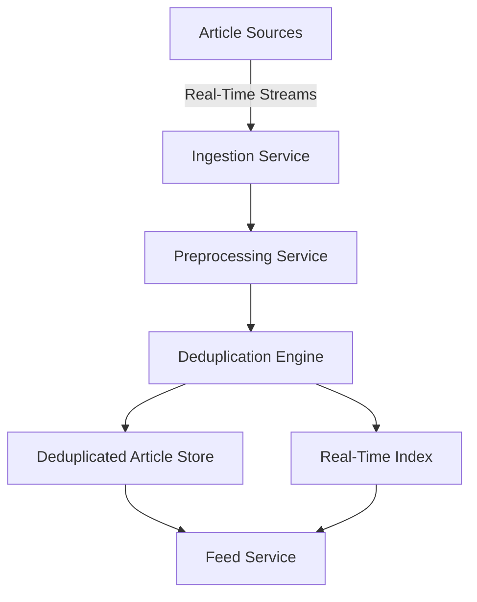
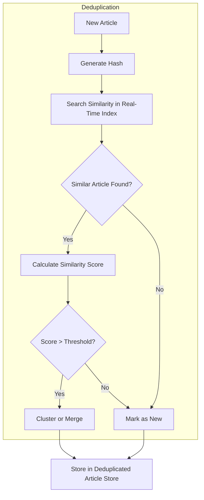
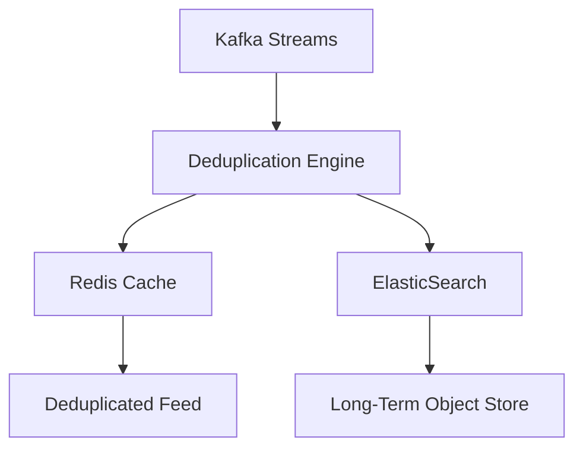

### **System Overview:**

The goal is to design a system that performs real-time deduplication of news articles fetched from various sources, ensuring that users do not see duplicate content while maintaining the freshness of news. This system must operate at scale, handling a high rate of incoming articles while maintaining low-latency operations. The key challenges include implementing efficient deduplication algorithms, managing real-time ingestion, ensuring accuracy, and providing strategies for handling false positives and negatives in deduplication.

---

### **1. Key Components of the System**

1. **Ingestion Layer**:
    - Handles incoming articles from multiple sources (RSS feeds, social media, web scraping, etc.) and streams the data into the system.
    - Each incoming article includes metadata like source, timestamp, author, title, and content.

2. **Preprocessing Layer**:
    - **Tokenization**: Articles are tokenized into smaller chunks (e.g., sentences or paragraphs) for further processing.
    - **Normalization**: Content is cleaned by removing stopwords, stemming, and lowering the case to ensure consistency across various articles.

3. **Deduplication Engine**:
    - **Content Fingerprinting**: Generate a unique hash (using techniques like SimHash, MinHash, or SHA256) to identify near-duplicate or exact articles.
    - **Similarity Calculation**: Use algorithms like Cosine Similarity or Jaccard Similarity to compute how similar two articles are, especially when content is not exactly the same but has common themes.
    - **Threshold-based Deduplication**: Set a similarity threshold (e.g., 85%) for articles to be considered duplicates.
    - **Merge/Cluster**: If articles are duplicates or similar, cluster them together, and choose a representative article (e.g., the one from the most reliable source) for display.

4. **Storage Layer**:
    - **Metadata Store**: Store article metadata such as title, author, source, timestamp, and hash value.
    - **Deduplicated Article Store**: Stores the original and clustered articles post-deduplication.
    - **Real-time Index**: Maintain an index that supports fast lookups for duplicate detection based on article hashes and metadata.
    
5. **Real-Time Matching Layer**:
    - Every new article goes through the deduplication engine and matches against existing articles stored in the system.
    - The system should respond in low-latency to either mark an article as new or deduplicate it.

6. **Feed Service**:
    - Once deduplicated, articles are served to the user feeds with low-latency requirements.
    - Uses techniques like caching to ensure feed freshness.

---

### **2. Ingestion Layer: Architecture**

- **Kafka / RabbitMQ** as the streaming layer to ingest articles in real-time from multiple sources.
- **Micro-batching** of articles for efficient processing and throughput, especially when dealing with millions of articles daily.
- Ensure that the ingestion layer is fault-tolerant and can handle backpressure from downstream systems (deduplication engine and feed service).

---

### **3. Deduplication Engine: Deep Dive**

- **Content Fingerprinting**:
    - **SimHash**: Efficient algorithm for identifying near-duplicate documents by comparing their hashes.
    - **MinHash**: Used for approximating the similarity between articles using Jaccard similarity of their sets (good for paragraphs).
    - **SHA256**: To detect exact duplicates by hashing the entire content of the article.

- **Similarity Calculation**:
    - **Cosine Similarity**: Measures the cosine of the angle between two articles represented as vectors of word counts.
    - **Jaccard Similarity**: Measures overlap between two sets of words in the articles, focusing on shared unique words.

- **Thresholds and Merging**:
    - Define thresholds for similarity (e.g., 85% cosine similarity).
    - For articles that exceed the similarity threshold, consider them duplicates and cluster them.
    - In case of duplicates, choose one based on predefined criteria such as source reliability, article freshness, or content length.

---

### **4. Real-Time Deduplication Challenges**

- **High-frequency Data Ingestion**:
    - Millions of articles need to be ingested and deduplicated in real-time. To handle this:
        - Use distributed stream processing (e.g., Apache Flink, Kafka Streams) to parallelize article processing.
        - Micro-batching to balance between throughput and real-time latency.
        - Implement sharding and partitioning strategies based on article metadata (e.g., source, timestamp) to distribute load across nodes.

- **Accuracy vs. Performance**:
    - **Trade-off 1**: Higher accuracy in deduplication (e.g., using more sophisticated algorithms like TF-IDF with Cosine Similarity) will increase processing time.
    - **Trade-off 2**: Lower latency requirements might push for simpler techniques (e.g., SimHash) at the expense of slightly higher false positives.
    - To balance accuracy and performance:
        - Use a two-phase deduplication approach: quick hash-based filtering followed by deeper content analysis for close matches.

---

### **5. Handling False Positives/Negatives**

- **False Positives**:
    - Articles incorrectly marked as duplicates. To mitigate this:
        - Adjust similarity thresholds carefully.
        - Incorporate article-specific metadata like author, source, and timestamp to refine matching.
        - Provide manual overrides or feedback mechanisms for editorial review.

- **False Negatives**:
    - Duplicate articles missed by the system. To reduce false negatives:
        - Regularly train and fine-tune the similarity algorithms (e.g., using machine learning models that can learn from past errors).
        - Use a hybrid approach (e.g., combining content and metadata deduplication techniques) to reduce misses.

---

### **6. Storage and Scalability Considerations**

- **Data Storage**:
    - **Metadata**: Store only metadata (title, source, timestamp) in fast-access storage like Elasticsearch or Redis.
    - **Deduplicated Content**: Store full articles (or pointers to the content) in object storage like AWS S3 or a NoSQL database (Cassandra, HBase).
    - Ensure historical versions of articles are retained for auditing purposes.

- **Real-Time Index**:
    - Implement a distributed indexing service for fast lookups of article hashes and content.
    - Keep indexes in memory for low-latency reads and updates (e.g., using Redis or a dedicated in-memory index service).

---

### **7. Merging Similar Articles**

- **Content Aggregation**:
    - When articles are duplicates, merge their metadata and content.
    - Choose the article from the most reliable source or merge by combining content from multiple sources into one article with citations to the original sources.
    - Update the feed only with the latest version of the merged article.

### **Conclusion**:
This system is designed to handle the real-time ingestion of articles, perform deduplication using hash-based techniques, and cluster similar articles while maintaining high throughput and low latency. The trade-offs between accuracy and performance are managed through the hybrid approach of fast hashing techniques combined with similarity calculations.

