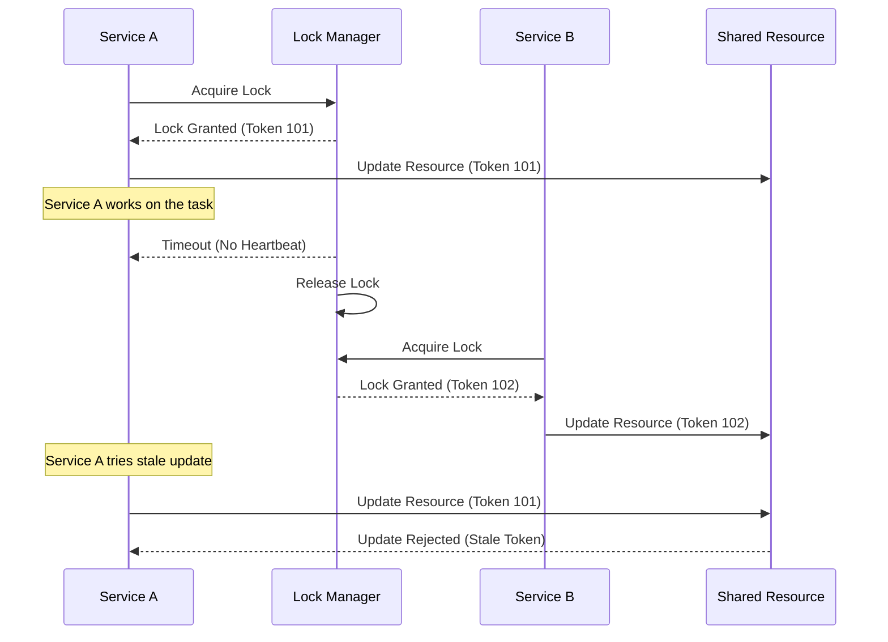
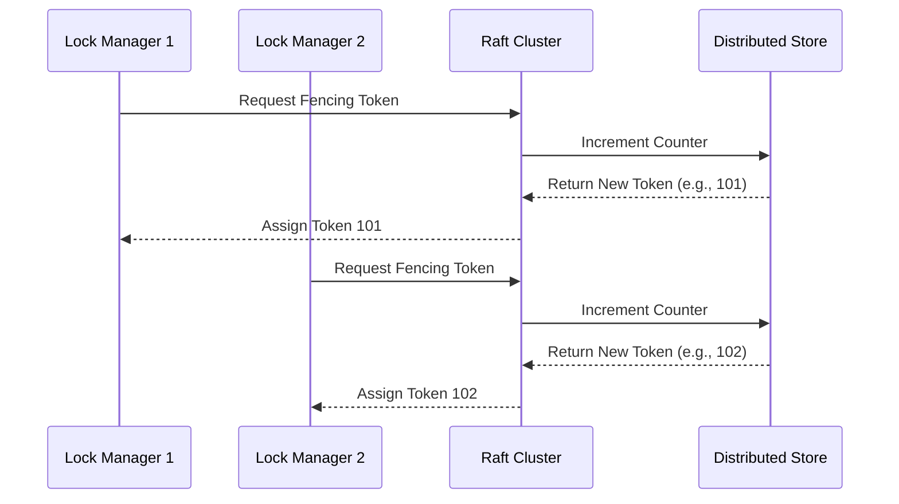
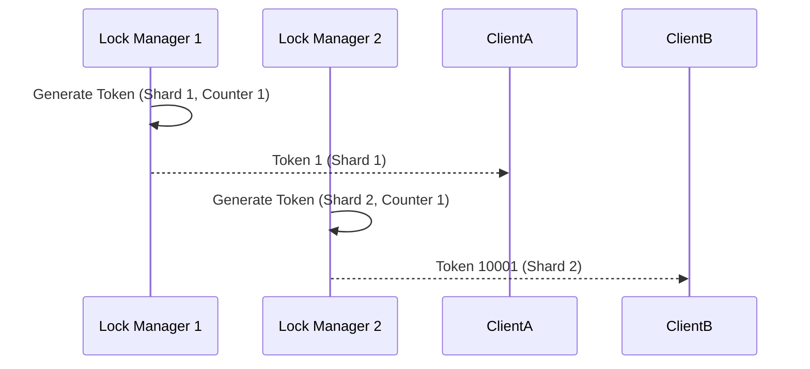
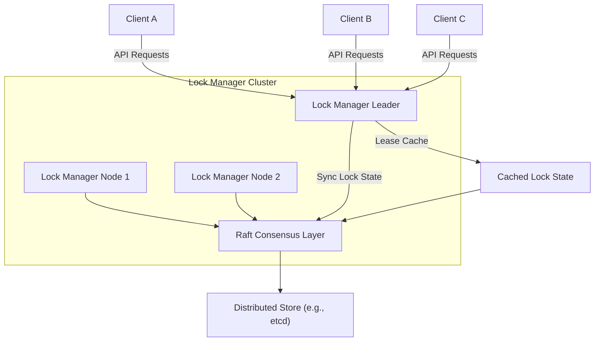

# **Designing a Fault-Tolerant Distributed Lock Service**

A **Distributed Lock Service** is essential for ensuring mutual exclusion in distributed systems. This service coordinates access to shared resources, ensuring that only one client can hold a lock for a resource at a time. Designing such a service involves addressing various challenges, including timeouts, stale locks, fault tolerance, and scalability.

This article combines all the key aspects of designing a distributed lock service, with detailed explanations, strategies for handling timeouts, token generation methods, and accompanying visual aids.

---

## **1. Overview of a Distributed Lock Service**

### **Key Features:**
- **Mutual Exclusion**: Ensures only one process can hold a lock at a time.
- **Fault Tolerance**: Handles node failures gracefully.
- **Scalability**: Supports high throughput for lock operations.
- **Deadlock Detection**: Avoids circular dependencies in lock acquisition.
- **High Availability**: Ensures availability even in the presence of failures.

---

## **2. Core Components**

### **Lock Manager**
The Lock Manager is the central component of the system, responsible for:
1. Handling lock acquisition, release, and renewal.
2. Maintaining lock states.
3. Managing timeouts and client heartbeats.

### **Consensus Layer**
Ensures consistent state replication across Lock Manager nodes using protocols like Raft, Paxos, or a distributed key-value store like etcd or ZooKeeper.

### **Storage Backend**
Stores lock states persistently, including:
- Lock ID
- Owner (Client ID)
- Expiration Time
- Metadata (e.g., resource details)

### **Client SDK**
Provides APIs for clients to:
- Acquire and release locks.
- Renew leases.
- Handle retries and timeouts.

---

## **3. Handling Lock Expiry and Stale Updates**

### **Problem**
When a service holding a lock times out and another service acquires the same lock, the original service might still attempt updates on the shared resource, leading to **split-brain scenarios**.

### **Solution Approaches**
#### **3.1 Fencing Tokens**
- Assign a unique, monotonically increasing **fencing token** to each lock acquisition.
- The resource validates the token for updates, rejecting stale requests with older tokens.

#### **Mermaid Diagram: Stale Update Prevention**


#### **3.2 Grace Periods**
- Add a short grace period before releasing the lock, giving the original service time to complete its task or send a heartbeat.

#### **3.3 Client Awareness**
- Notify clients about lock expiry via callbacks or lease checks, so they can abort ongoing tasks.

#### **3.4 Conditional Updates**
- Require locks to include version checks (e.g., Compare-And-Swap operations) for all updates, rejecting stale operations.

#### **3.5 Idempotent Resource Updates**
- Design resources to handle updates idempotently, ensuring the same operation can be repeated safely.

---

## **4. Multiple Lock Manager Instances and Token Generation**

In a fault-tolerant system, multiple instances of the Lock Manager must work together to ensure lock consistency. Generating unique, monotonically increasing fencing tokens is critical.

### **Token Generation Strategies**

#### **4.1 Centralized Counter Using Distributed Consensus**
- Use Raft or a distributed key-value store (e.g., etcd) to maintain a centralized counter.
- Each lock acquisition increments the counter atomically.

**Mermaid Diagram: Centralized Counter**


---

#### **4.2 Sharded Token Generation**
- Assign each Lock Manager instance a unique shard ID.
- Generate tokens locally using the format:
  ```plaintext
  token = (shard_id << 48) | local_counter
  ```

**Mermaid Diagram: Sharded Token Generation**


---

#### **4.3 Leader-Driven Token Generation**
- Elect a single Lock Manager leader using Raft.
- The leader generates tokens centrally and assigns them to requests from other instances.

---

#### **4.4 Hybrid Local Generation with Coordination**
- Lock Managers fetch blocks of token ranges from a central store.
- Tokens are generated locally from these ranges until exhausted.

---

#### **4.5 Clock-Based Tokens**
- Use logical or hybrid clocks to generate unique tokens based on timestamps and instance IDs.

---

### **Comparison of Token Generation Approaches**

| Approach                          | Monotonicity | Fault Tolerance | Latency       | Scalability  | Complexity |
|-----------------------------------|--------------|-----------------|---------------|--------------|------------|
| Centralized Counter               | ✅            | ✅              | High          | Moderate     | Low        |
| Sharded Token Generation          | ✅            | ❌ (shard fail) | Low           | High         | Moderate   |
| Leader-Driven Token Generation    | ✅            | ✅              | Moderate      | Moderate     | Low        |
| Hybrid Local with Coordination    | ✅            | ✅              | Low           | High         | High       |
| Clock-Based Tokens                | ✅            | ❌ (sync fail)  | Low           | High         | High       |

---

## **5. Handling Lock Expiry and Updates**

Combining token generation and resource management techniques ensures that:
1. **Fencing tokens** prevent stale updates.
2. **Grace periods** provide resilience against transient failures.
3. **Client notifications** align tasks with lock states.

---

## **6. Final Architecture**

### **Mermaid Diagram: Distributed Lock Service**


---
