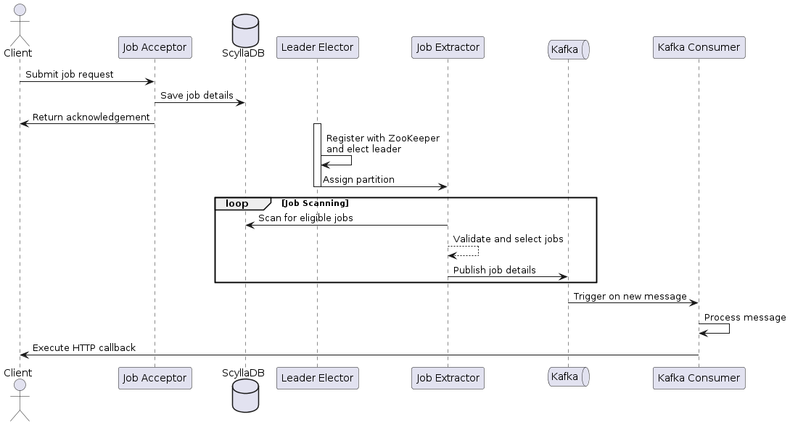
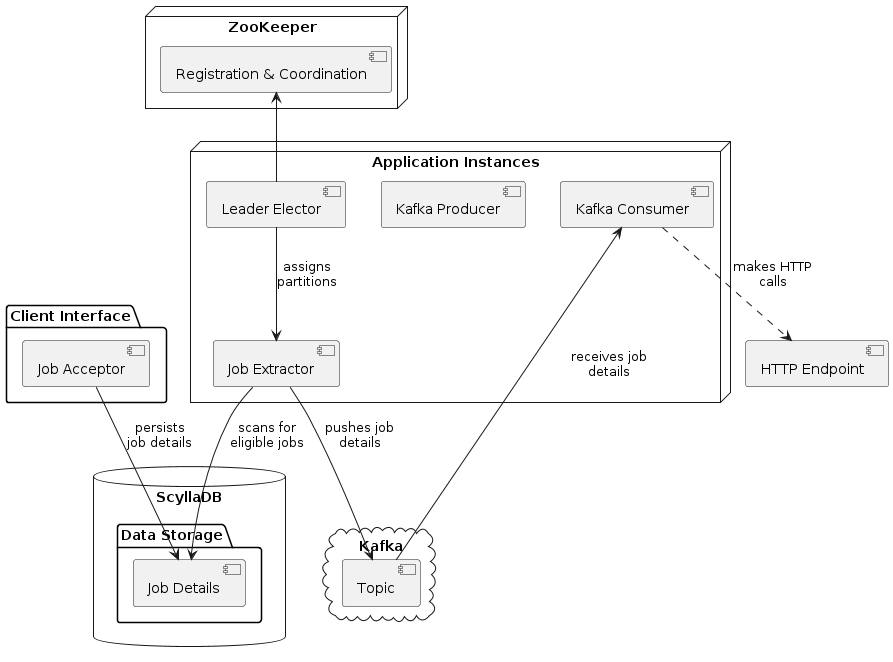

# Implementing a distributed task scheduler

The system is designed to manage and execute time-sensitive jobs with high efficiency and reliability. It incorporates a Job Acceptor for handling client requests, a Job Extractor for identifying and dispatching eligible jobs, a Leader Elector for coordination among multiple instances, and Kafka for messaging and job execution notifications.
Detailed Component Descriptions

- [Implementing a distributed task scheduler](#implementing-a-distributed-task-scheduler)
  - [Interaction Diagram](#interaction-diagram)
  - [High Level System Design](#high-level-system-design)
  - [Components](#components)
    - [Job Acceptor](#job-acceptor)
    - [Job Extractor](#job-extractor)
    - [Leader Elector](#leader-elector)
    - [Kafka Producer](#kafka-producer)
    - [Kafka Consumer](#kafka-consumer)

## Interaction Diagram

```
@startuml
actor Client

participant "Job Acceptor" as Acceptor
database "ScyllaDB" as DB
participant "Leader Elector" as Elector
participant "Job Extractor" as Extractor
queue "Kafka" as Kafka
participant "Kafka Consumer" as Consumer

Client -> Acceptor : Submit job request
Acceptor -> DB : Save job details
Acceptor -> Client : Return acknowledgement
activate Elector
Elector -> Elector : Register with ZooKeeper\nand elect leader
Elector -> Extractor : Assign partition
deactivate Elector
loop Job Scanning
    Extractor -> DB : Scan for eligible jobs
    Extractor --> Extractor : Validate and select jobs
    Extractor -> Kafka : Publish job details
end
Kafka -> Consumer : Trigger on new message
Consumer -> Consumer : Process message
Consumer -> Client : Execute HTTP callback
@enduml

```




## High Level System Design

```
@startuml

package "Client Interface" {
    [Job Acceptor]
}

database "ScyllaDB" {
    folder "Data Storage" {
        [Job Details]
    }
}

node "ZooKeeper" {
    [Registration & Coordination]
}

cloud "Kafka" {
    [Topic]
}

node "Application Instances" {
    [Leader Elector]
    [Job Extractor]
    [Kafka Producer]
    [Kafka Consumer]
}

[Job Acceptor] --> [Job Details] : persists\njob details
[Job Extractor] --> [Job Details] : scans for\neligible jobs
[Job Extractor] --> [Topic] : pushes job\ndetails
[Topic] --> [Kafka Consumer] : receives job\ndetails
[Kafka Consumer] ..> [HTTP Endpoint] : makes HTTP\ncalls

[Registration & Coordination] <-- [Leader Elector]
[Leader Elector] --> [Job Extractor] : assigns\npartitions

@enduml

```



## Components

### Job Acceptor

Role: Handles client requests, validates them, and persists job details in ScyllaDB.
Key Operation: Assigns a random Partition ID to each job for efficient data distribution and query performance in ScyllaDB.

The Job Acceptor is a client-facing module responsible for accepting and validating incoming client requests. It persists job details in ScyllaDB and returns an acknowledgement to the client. While persisting job details, a random Partition ID is assigned to each Job ID, facilitating distributed data storage and efficient query processing in ScyllaDB.

### Job Extractor

Role: Identifies jobs eligible for execution based on their scheduled times and current time.
Key Operation: Executes time-range scans in ScyllaDB to find eligible jobs and pushes job details to Kafka for processing.

The Job Extractor is tasked with identifying jobs that are eligible for execution. A job becomes eligible if its scheduled execution time is less than or equal to the current time. It locates eligible jobs by executing a ScyllaDB scan query within a specified time range. Once an eligible job is found, the details are pushed to Kafka one by one to allow the extractor to perform the next scan as swiftly as possible.

Sample Job schema
```
CREATE TABLE IF NOT EXISTS jobs (
    partition_id int,
    job_id text,
    job_type text,
    status text,
    execution_time timestamp,
    callback_url text,
    created_at timestamp,
    updated_at timestamp,
    PRIMARY KEY (partition_id, execution_time, job_id)
) WITH CLUSTERING ORDER BY (execution_time ASC);

```

```java
import com.datastax.oss.driver.api.core.CqlSession;
import com.datastax.oss.driver.api.core.cql.*;

public class JobRepository {
    private CqlSession session;

    public JobRepository(CqlSession session) {
        this.session = session;
    }

    // Method to insert a job into the database
    public void insertJob(Job job) {
        String query = "INSERT INTO jobs (partition_id, job_id, job_type, status, execution_time, callback_url, created_at, updated_at) VALUES (?, ?, ?, ?, ?, ?, ?, ?);";
        PreparedStatement prepared = session.prepare(query);
        BoundStatement bound = prepared.bind(job.getPartitionId(), job.getJobId(), job.getJobType(), job.getStatus(), job.getExecutionTime(), job.getCallbackUrl(), job.getCreatedAt(), job.getUpdatedAt());
        session.execute(bound);
    }

    // Method to fetch eligible jobs based on execution time
    public ResultSet fetchJobs(int partitionId, long fromExecutionTime, long toExecutionTime) {
        String query = "SELECT * FROM jobs WHERE partition_id = ? AND execution_time <= ? AND execution_time >= ? ALLOW FILTERING;";
        PreparedStatement prepared = session.prepare(query);
        BoundStatement bound = prepared.bind(partitionId, toExecutionTime, fromExecutionTime);
        return session.execute(bound);
    }
}

```

### Leader Elector

Role: Ensures that each client is handled by one leader instance to manage work distribution and prevent duplicate job processing.
Key Operation: Uses ZooKeeper for instance registration and leader election among the clockwork instances.

*ETCD/Redis can also be used here*

Given that multiple instances of the application may run simultaneously, the Leader Elector plays a crucial role in coordinating these instances to prevent the double execution of jobs. This module:

    Registers each application instance with ZooKeeper with a unique worker ID upon startup.
    Checks if a leader has already been elected for a client. If not, the instance attempts to become the leader.
    The elected client leader then assigns partitions to the worker (extractors) across different application instances in a round-robin manner to ensure that no two instances scan the same partition.

### Kafka Producer

Role: Publishes job details to Kafka topics following rate limits to ensure system stability.
Key Operation: Controls message flow to Kafka based on the consumer's ability to process messages.

Once the Job Extractor fetches a list of eligible jobs and performs necessary validations, the details are published to Kafka. A Rate Limiter is employed to ensure messages are published at a rate that does not exceed the consumption capacity, thus preventing instability due to an overwhelming backlog. Scanning is dynamically paused if the queue size reaches a configurable threshold, resuming as soon as the client can handle more callbacks and the queue size decreases.

### Kafka Consumer

Role: Processes messages from Kafka topics by executing HTTP callbacks based on job details.
Key Operation: Implements client-specific retry strategies and manages failed messages via a Dead-Letter Queue.

The Kafka Consumer listens for messages on Kafka topics and processes them by making HTTP calls to specified URL endpoints. Failures in making these calls are handled according to client-specific retry strategies, which may include dropping failed messages or retrying with exponential backoff and random jitter. Messages for which retries are exhausted without success are pushed to a Dead-Letter Queue until they are either moved back to the main queue or expire.


Note: This is a modified version base on [this](https://tech.phonepe.com/clockwork-the-backbone-of-phonepes-2-billion-daily-jobs/) article