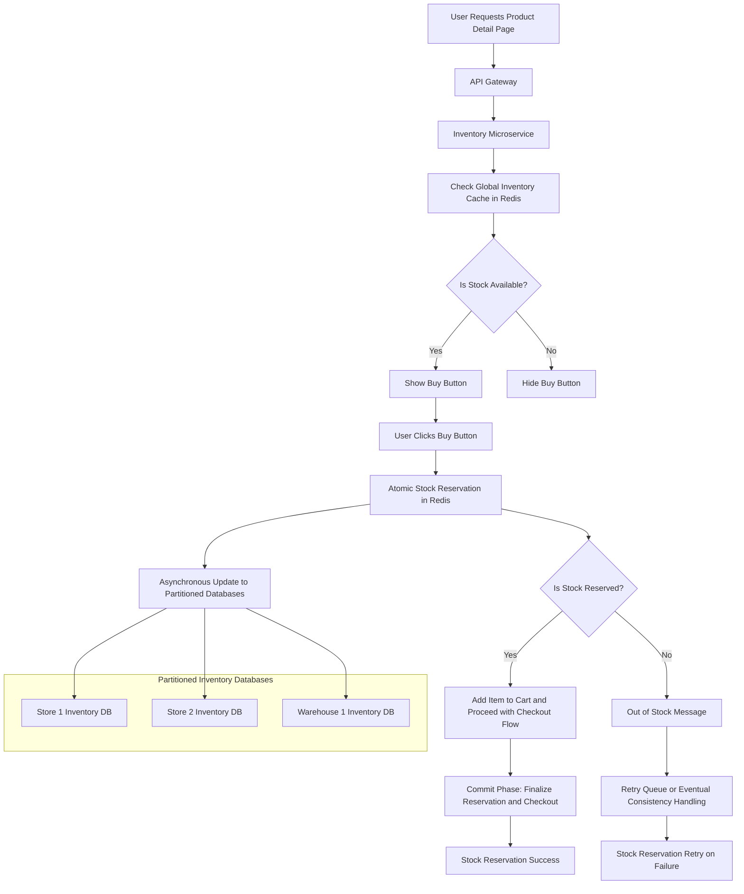

To ensure **system consistency** in case of failures during the process—especially when handling **stock reservation** and **count updates** as the user adds an item to the cart—it’s crucial to implement mechanisms that maintain the integrity of the stock data and provide a fallback plan when parts of the system fail.

In this section, I will explain how to make the system consistent, even in the event of failures, and ensure that the stock is correctly updated when the item is added to the cart. I'll also focus on ensuring **atomicity**, **durability**, and **eventual consistency** to avoid stock discrepancies.

### Consistency and Failure Handling in Stock Reservation and Cart Operations

#### 1. **Atomic Stock Reservation and Cart Addition**

When a user clicks the **Buy button** to add an item to the cart, the stock needs to be **atomically reserved**. This ensures that once the item is added to the cart, it is guaranteed to be available for purchase.

**Key Steps**:
- **Atomicity**: Ensure that the operations (reserving the stock and adding the item to the cart) are atomic. This means both steps either succeed together or fail together.
- **Durability**: Use a **transactional model** to ensure that if a failure occurs after stock is reserved but before the item is added to the cart, the system can roll back and release the reserved stock.

#### Example Flow for Atomic Stock Reservation and Cart Addition:
1. **User Clicks Buy Button**:
   - The request is sent to the **Inventory Microservice**, which performs a check to reserve stock.
   
2. **Atomic Reservation in Redis**:
   - The **stock count is decremented** atomically in Redis using the `DECR` or **Lua script** to prevent race conditions (already covered in earlier steps).

3. **Add to Cart**:
   - If the stock is successfully reserved, the item is **added to the cart**.
   - The system must ensure that **both the stock reservation and the cart addition happen atomically**. If either fails, the stock is released back.

4. **Database and Redis Sync**:
   - Once the item is added to the cart, the system performs an **asynchronous write-behind** to the **partitioned databases** to update the reserved stock count for the relevant store or warehouse.

---

### 2. **Consistency in the Event of Failure**

Failures can occur at various stages, and the system must have a **failure recovery strategy** to handle these situations. Here are key techniques to ensure consistency:

#### a. **Distributed Transaction Handling with Two-Phase Commit (2PC)**

One way to ensure that **both stock reservation** and **cart addition** happen consistently, even in case of a failure, is by using the **Two-Phase Commit (2PC)** protocol.

**Step-by-Step Process**:
1. **Prepare Phase**:
   - **Stock Reservation**: Reserve the stock in Redis or the partitioned database.
   - **Add to Cart**: Prepare to add the item to the cart (e.g., flag the item in the user’s session).
   - Both operations are initiated, but neither is committed until both succeed.
   
2. **Commit Phase**:
   - If both operations succeed in the **prepare phase**, they are committed.
   - If either operation fails, the transaction is **rolled back**, and the stock is released.

#### b. **Fallback with Eventual Consistency (Retry Mechanism)**

If a failure occurs during the stock reservation or the cart addition, the system should fall back on an **eventual consistency model** using a **retry mechanism**. In this case, if Redis or the database becomes unavailable during the update, the system will try again once the services are back online.

**Retry Queue**:
- Use a **message queue** (e.g., Kafka, RabbitMQ) to record stock reservation and cart addition events.
- If the stock reservation or cart addition fails, the event is retried from the queue.
- Once Redis or the database becomes available, the system processes the queued events and updates the stock and cart.

#### c. **Optimistic Locking for Database Updates**

When writing to the partitioned databases, ensure that **optimistic locking** is used to prevent inconsistent data being written by multiple transactions. This technique allows the system to:
- Retry the database write if there’s a version conflict.
- Guarantee that the **correct stock levels** are persisted in the database even if multiple requests are competing.

---

### 3. **Handling Cart Expiration and Stock Release**

To ensure **consistent stock availability**, it’s critical to handle cart expiration and stock release properly.

#### a. **Expiration of Reserved Stock**

If a user adds an item to the cart but does not complete the purchase within a defined window (e.g., 10 minutes), the reserved stock should be **released back** to the available inventory.

**Steps**:
1. **Set a TTL (Time-to-Live)** on the reservation in Redis or the database.
   - Example: Redis sets a TTL of 10 minutes on the reserved stock.
   
2. **Release Stock on Expiration**:
   - If the cart expires, the reserved stock is automatically returned to the available pool.
   - Redis operations (e.g., `INCR` to increase the available stock) can be used to release the reserved stock.

#### Example Redis Command:
```redis
INCR inventory:product:{product_id}  # Increase available stock if the cart expires
```

#### b. **Consistency with Stock Return**

If the user abandons the cart:
- Ensure that the system returns the **reserved stock** back to the available pool in both Redis and the partitioned databases.
- Use the **retry queue** or **background job** to handle the stock return operation, ensuring that the stock is consistently updated across all systems.

---

### 4. **Handling 60K RPS with Stock Reservation**

To handle **60K RPS** when there is **only one item available** to reserve, follow these strategies to maintain **consistency and performance**:

#### a. **Optimized Redis Usage with Atomic Operations**

- Use **atomic operations** like `DECR` or **Lua scripting** in Redis to ensure that only one user can successfully reserve the last available item. Redis guarantees **atomicity**, meaning only one operation will succeed in decrementing the stock when multiple users try to reserve the same item.

#### b. **Rate Limiting and Caching of Out-of-Stock Responses**

- Use **rate limiting** at the API Gateway level to prevent the backend from being overwhelmed by high RPS. Limit the number of requests that can hit the backend in any given second, ensuring that Redis and the databases aren’t flooded with excessive requests.
- Cache **out-of-stock responses** for short periods (e.g., 1 second) when there is no stock available. This reduces the number of times Redis is hit for the same product when it’s already out of stock.

#### c. **Race Condition Prevention**

- When the last available item is reserved, cache the **"out of stock"** message in Redis for a short period. This ensures that subsequent requests don’t attempt to reserve non-existent stock, reducing the chances of race conditions.

---

### Summary of the Complete Flow

1. **User Requests Product Detail Page**:
   - The Inventory Microservice queries Redis for **global availability**.
   - The "Buy" button is shown if stock is available.

2. **User Clicks Buy Button**:
   - **Stock Reservation**: The system atomically reserves stock in Redis.
   - **Add to Cart**: The item is added to the cart, and the system ensures both operations succeed together.
   - **Write to Databases**: Stock reservation is asynchronously updated in the partitioned databases.

3. **Handling Failures**:
   - **Two-Phase Commit**: Ensures atomicity of stock reservation and cart addition.
   - **Retry Queue**: Handles failures by retrying stock reservation and cart addition when systems recover.
   - **Optimistic Locking**: Prevents inconsistent writes to the database when multiple transactions occur.

4. **Cart Expiration and Stock Return**:
   - If the user abandons the cart, the system releases the reserved stock back to Redis and the databases.

5. **Handling High RPS**:
   - **Rate Limiting**: Prevents excessive load on Redis and the databases by limiting the number of requests allowed to hit the backend.
   - **Atomic Operations in Redis**: Ensures that only one user can reserve the last available item.

---

### Final Diagram: End-to-End Flow with Failure Handling and Stock Reservation



This updated flow ensures **data consistency** across Redis, partitioned databases, and the cart, even under failure conditions.
