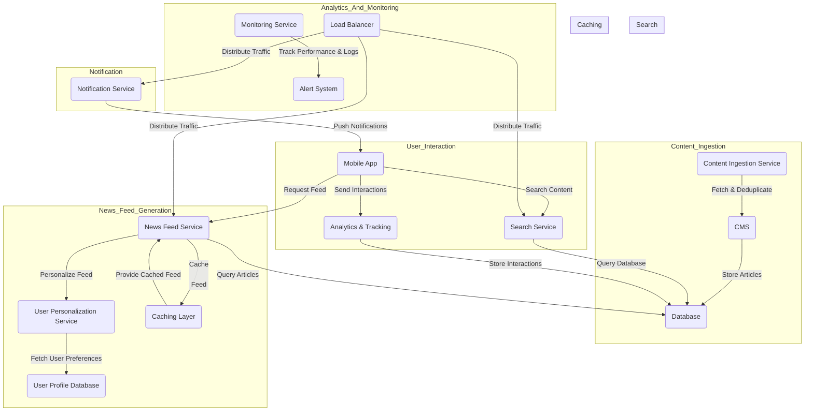

## Designing a Backend System for a News Feed App like Inshorts: A Detailed Guide

### Overview

Building a backend system for a news feed app like **Inshorts** requires a scalable architecture that can handle large volumes of real-time news content, personalized feeds, search functionalities, and user interactions. The system must efficiently support millions of daily active users (DAUs) with near-instantaneous content delivery, robust personalization, and real-time updates.

This guide provides an in-depth look into the system architecture, with a particular focus on the **Personalization Service**, its data models, and how various services interact to deliver a seamless news feed experience. We will also explore the caching strategies, notification service, and monitoring mechanisms needed to support the system's performance.

---

### Key Components of the System

1. **Content Ingestion Service**
2. **Content Management System (CMS)**
3. **News Feed Generation Service**
4. **Personalization Service**
5. **Notification Service**
6. **Search Service**
7. **User Interaction & Analytics**
8. **Caching Layer**
9. **Monitoring & Alerting**

We will now deep-dive into each component with detailed interactions, data models, and technology considerations.

---

### 1. **Content Ingestion Service**

#### Deep Dive:
The **Content Ingestion Service** is responsible for gathering news articles from various sources such as RSS feeds, social media APIs, and other external data providers. Since the system must handle large volumes of news content, real-time ingestion is crucial.

- **Deduplication**: The ingestion service performs deduplication to prevent redundant articles from being stored.
- **Content Processing**: This includes parsing, categorizing, and tagging content with metadata like keywords, topics, and language.

#### Data Flow:
- The ingestion service fetches news data, processes it, and stores the normalized articles in the **CMS** and **Database**.
  
#### Technologies:
- **Message Queues (e.g., Kafka)**: For scalable, event-driven ingestion of news articles.
- **Data Processing Pipelines (e.g., Apache Flink)**: For real-time data processing and enrichment of news articles.
  
---

### 2. **Content Management System (CMS)**

#### Deep Dive:
The **CMS** is responsible for the lifecycle of articles—ingestion, editing, publishing, and deletion. Editors can modify articles and push changes in real-time.

#### Data Flow:
- The CMS interacts with the **Database** to store and retrieve articles. It maintains article metadata, which is later used for filtering and personalization.

#### Technologies:
- **Relational Databases (e.g., PostgreSQL)**: For structured storage of articles and metadata.
- **NoSQL Databases (e.g., MongoDB)**: For quick reads and flexible storage of article versions and content.

---

### 3. **News Feed Generation Service**

#### Deep Dive:
This service generates a personalized feed for each user by querying articles from the database and personalizing it based on user preferences, behavior, and real-time interaction data.

#### Key Responsibilities:
- **Fetching Content**: Retrieves articles from the **Database** based on time, category, or popularity.
- **Ranking Algorithms**: Uses ranking mechanisms (like collaborative filtering or content-based filtering) to display the most relevant articles to the user.
- **Interaction with Personalization Service**: Calls the **Personalization Service** to apply user preferences, past interactions, and engagement history.

#### Data Flow:
- Requests articles from the **Database** and integrates personalization data before returning the feed to the **Mobile App**.

#### Technologies:
- **GraphQL** for flexible querying and real-time feed generation.
- **ElasticSearch** for fast searches and retrievals.

---

### 4. **Personalization Service**

The **Personalization Service** is central to delivering a customized experience to users. Let’s dive deeper into how it works and how it interacts with other components.

#### Core Features:
1. **User Profiles**: Stores detailed information about each user, including:
   - **Interaction history**: Clicks, likes, shares, reads, and skipped articles.
   - **Content preferences**: Topics, categories, and tags the user is most interested in.
   - **Demographics**: Location, language, age group, etc.
   - **Engagement metrics**: Time spent reading articles, number of articles read per session, etc.

2. **Behavior Tracking**: 
   - The system tracks user behavior in real-time, continuously updating preferences and interaction history.
   - For instance, if a user consistently reads articles about sports, the system increases the weight of sports content in their feed.

3. **Machine Learning Models**: 
   - **Collaborative Filtering**: Recommends articles based on the behavior of similar users.
   - **Content-Based Filtering**: Recommends articles similar to the ones a user has interacted with.
   - **Hybrid Models**: Combines both approaches to provide balanced recommendations.

4. **Real-Time Personalization**:
   - Adjusts personalization dynamically based on the user’s most recent interactions, ensuring fresh and relevant content.
   - Example: If a user suddenly engages with political content, the system will prioritize similar content immediately.

#### Personalization Data Model:

```yaml
UserProfile:
  userId: String
  preferences: List[Category]
  interactionHistory: List[Interaction]
  demographics: Demographics
  lastUpdated: DateTime

Category:
  id: String
  name: String
  engagementScore: Float  # Indicates how much the user engages with this category

Interaction:
  articleId: String
  timestamp: DateTime
  action: Enum[CLICK, LIKE, SHARE, SKIP]
  engagementScore: Float  # Score assigned based on the type of action

NewsArticle:
  articleId: String
  title: String
  content: String
  category: String
  publishedAt: DateTime
  source: String
  tags: List[String]

Demographics:
  location: String
  ageGroup: String
  language: String
```

---

### 5. **Notification Service**

#### Deep Dive:
This service pushes breaking news or important content to users based on their preferences and interaction history.

#### Features:
- **Real-Time Notifications**: Uses a Pub/Sub model to push notifications instantly to users when relevant articles are published.
- **Segmentation**: Sends notifications to specific user groups based on location, preferences, or past engagement.
- **Notification Throttling**: To avoid spamming users, the service limits the frequency of notifications.

#### Data Flow:
- Listens to article updates and sends relevant notifications to users based on their personalization profile.

#### Technologies:
- **Push Notification Services**: Google Firebase or Apple Push Notification Service (APNs).
  
---

### 6. **Search Service**

#### Deep Dive:
The **Search Service** allows users to search for specific articles, topics, or keywords across the entire content database.

#### Features:
- **Full-Text Search**: Implements a full-text search engine to provide fast search results.
- **Ranking Algorithms**: The search results are ranked based on article relevance, publication date, and user preferences.

#### Technologies:
- **ElasticSearch**: For fast, scalable search across millions of articles.

---

### 7. **User Interaction & Analytics**

#### Deep Dive:
This component tracks user interactions like clicks, likes, shares, and reads, sending data to the **Analytics & Tracking Service** for further analysis.

#### Features:
- **Real-Time Interaction Tracking**: Each user interaction is tracked in real-time to keep the personalization profiles updated.
- **Data for Machine Learning**: These interactions feed back into machine learning models to continuously improve recommendations.

#### Technologies:
- **Kafka**: For real-time event streaming and logging of user interactions.
- **Big Data Systems (e.g., Hadoop, Spark)**: For aggregating and processing large amounts of interaction data.
  
---

### 8. **Caching Layer**

#### Deep Dive:
To ensure scalability, frequently accessed news articles and personalized feeds are cached to reduce the load on the backend database.

#### Caching Strategies:
- **Content Caching**: Popular articles and feeds are cached at the edge, using content delivery networks (CDNs) like **Cloudflare** or **AWS CloudFront**.
- **User Feed Caching**: Personalized feeds are cached for a short duration (e.g., 5-10 minutes) to avoid recomputing the feed for every request.

#### Technologies:
- **Redis** or **Memcached** for in-memory caching of news articles and feeds.

---

### 9. **Monitoring & Alerting**

#### Deep Dive:
This component tracks the health of the system and provides real-time alerts if issues arise.

#### Features:
- **Performance Monitoring**: Tracks the performance of services (e.g., latency, error rates) and triggers alerts if thresholds are breached.
- **Log Aggregation**: Collects logs from all services for centralized viewing and analysis.

#### Technologies:
- **Prometheus + Grafana**: For real-time monitoring of metrics.
- **ELK Stack (ElasticSearch, Logstash, Kibana)**: For log aggregation and visualization.

---

### Complete System Diagram

Here’s the **Mermaid.js** diagram representing the entire backend system architecture:



---

### Conclusion

This architecture ensures a scalable, personalized, and highly performant news feed app. By utilizing the **Personalization Service** with real-time behavior tracking and machine learning models, the app can deliver highly relevant news to each user. Efficient caching, robust search functionality, and real-time notifications further enhance the user experience while keeping backend performance optimal. The monitoring and alerting systems ensure that the system is always up and running smoothly.
