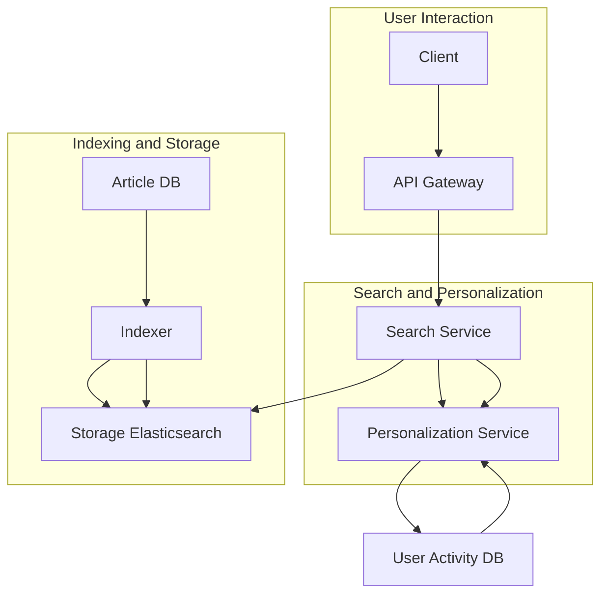
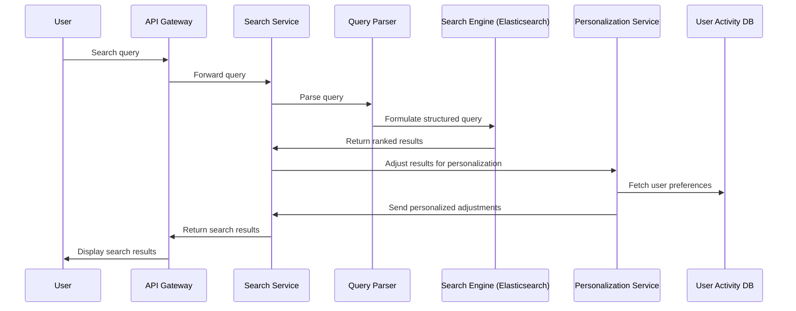
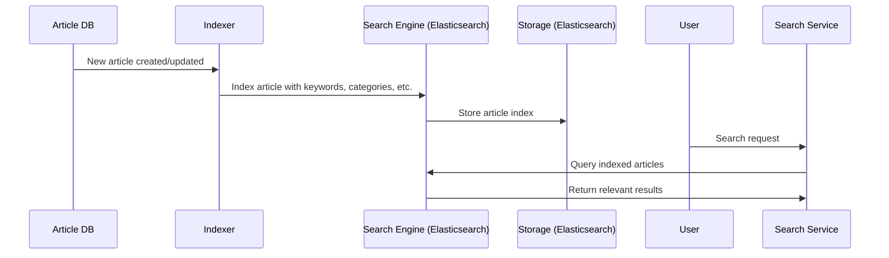

Let's break down the design of the Search Service for a news feed app. This system will support full-text search, ranking algorithms, filtering, indexing, scaling for millions of queries, and personalization.

### 1. **High-Level Architecture**

- **Client Layer**: Web/mobile app to allow users to input search queries and view results.
- **API Gateway**: For handling requests and directing them to the appropriate microservices.
- **Search Service**: Core service responsible for handling user search queries, personalized results, and interaction with other components like the indexing service, recommendation engine, and storage.

### 2. **Components Breakdown**
#### **Search Service**
- **Query Parser**: Parses user input into structured queries. For example, if a user searches for "technology news in the last week," it breaks the query into keywords (`technology`), filters (`last week`), and categories (`news`).
- **Search Engine Integration**: Interfaces with a full-text search engine (like **Elasticsearch** or **Solr**) that provides real-time indexing and retrieval of articles.
- **Ranking Algorithms**: Results are ranked based on relevance. Incorporating personalization using **user behavior** (clicks, likes, views), and **collaborative filtering**.
- **Personalization**: Adjusts search results based on user history and preferences, powered by a **Personalization Service**.

#### **Personalization Service**
- **User Profiles**: Maintains information about user interests, reading habits, interaction data, etc.
- **Behavioral Analysis**: Tracks click-through rates, dwell time, article likes, shares, and similar metrics.
- **Collaborative Filtering**: Suggests content based on similarities between user profiles.

#### **Indexer**
- **Real-Time Indexing**: Handles the ingestion and processing of new articles. Extracts metadata like keywords, categories, topics, publication date, and author.
- **Batch Processing**: For historical data or bulk inserts of older articles.
- **Document Sharding and Partitioning**: Supports partitioning the index into smaller shards for performance. This is especially important for high-volume news articles.

#### **Storage Layer**
- **Elasticsearch**: Provides full-text search capabilities and can be scaled horizontally. Index documents for articles, including fields like title, content, author, category, keywords, and timestamps.
- **Article DB**: Stores the actual article content and metadata. Elasticsearch indexes a subset of fields like title, keywords, and category for search purposes.

#### **User Activity Database**
- Stores user interactions (e.g., clicks, shares, likes) and search history for personalization.

### 3. **Indexing Strategy**
- **Inverted Indexing**: Elasticsearch will use inverted indexes to quickly look up terms across documents. It breaks down articles into terms and maps them to document IDs for efficient retrieval.
- **Fielded Search**: Index documents with structured fields such as title, body, category, and tags. Each field can be searched independently.
- **Batch and Real-Time Indexing**: Articles are indexed in near real-time for immediate availability. For historical articles, a batch indexing process will run to populate the search index.

### 4. **Ranking Algorithm**
- **TF-IDF** (Term Frequency-Inverse Document Frequency) and **BM25**: Basic ranking algorithms that measure the relevance of the search terms within a document.
- **Personalized Ranking**: Personalized results will be ranked based on user preferences, behavior, and collaborative filtering.
- **Freshness**: Newer articles will be boosted to appear more prominently when relevant.
- **Popularity**: Articles with more user interaction (likes, clicks, shares) are ranked higher.

### 5. **Filtering by Category, Tags, and Date**
- Elasticsearch allows for **faceted search** using filters on fields like `category`, `tags`, and `published date`.
- Users can refine their searches by selecting one or more of these facets.

### 6. **Handling Scale**
- **Horizontal Scaling**: Elasticsearch will be deployed with multiple nodes and shards to scale with the volume of data and queries.
- **Caching Layer**: For frequently searched terms or popular articles, use a caching mechanism like **Redis** to reduce query load.
- **Rate Limiting**: Implement rate limiting on API requests to avoid overloading the search service.

### 7. **Deep Dive into Personalization**
Personalization will adjust results based on user interactions with content. This involves:
- **User Profiles**: Store user preferences, history, and behavior.
- **Collaborative Filtering**: Recommend articles based on what similar users have read.
- **Clickstream Data**: Track what articles users click on, dwell time on articles, etc.
- **Content-Based Filtering**: Recommending similar content based on the articles the user has engaged with.

### 8. **Mermaid Diagrams for Deep Dive Components**
#### **Search Flow**

#### **Indexing Flow**

### 9. **Entities**
- **Article**
  - `id`: Unique identifier
  - `title`: Article title
  - `content`: Article body
  - `category`: News category
  - `tags`: Tags assigned to the article
  - `author`: Article author
  - `published_at`: Timestamp of publication
  - `popularity_score`: Score based on user interactions

- **User Activity**
  - `user_id`: Unique identifier for the user
  - `article_id`: Identifier of the article interacted with
  - `interaction_type`: E.g., click, like, share
  - `timestamp`: Time of interaction

- **Personalization Profile**
  - `user_id`: Unique identifier
  - `preferences`: List of categories, keywords, and tags the user prefers
  - `click_history`: List of articles the user has clicked on
  - `engagement_score`: Score measuring how much the user interacts with content in specific categories

This design is scalable and optimized for low-latency searches while ensuring personalized results. Let me know if you want to explore any specific section further.
