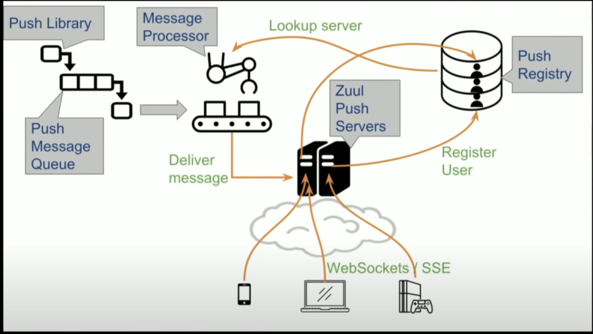

This is based on https://www.youtube.com/watch?v=6w6E_B55p0E 

The overall architecture is 

## Zuul push servers
Zuul push servers are netty based servers that handle huge number of live connections.

## Push registry

This keeps track of the mapping for the push client to the server it is connected too. As this will be called by multiple message processors to get the server details for a client, it should have
1. low read latency
2. Record expiry to clear phantom mappings caused by dead clients or servers
3. Sharding
4. Replication

**Dynomite** is a wrapper over Redis that supports auto sharding, read/write quorom, cross region replication etc. 

## Message Processing

Kafka is used to hold the messages. Different topics for different priorities. 

The connections from the client to the server is persistant. This makes it difficult to quick deploy or rollback. As when we want to create a new cluster, we need to migrate the clients connected to the old cluster to the new cluster. Killing all the old connections will result in **Thundering Herd** issue which simply means that all the clients will come running for new connection at the same thus bringing down the whole cluster. 

In order to avoid this, one approach can be to design client such that they have a defined life time of the connection and after the connection timeout, they retry for the connection. This can also be optimized to have the timeout as a range instead of a fixed value. 