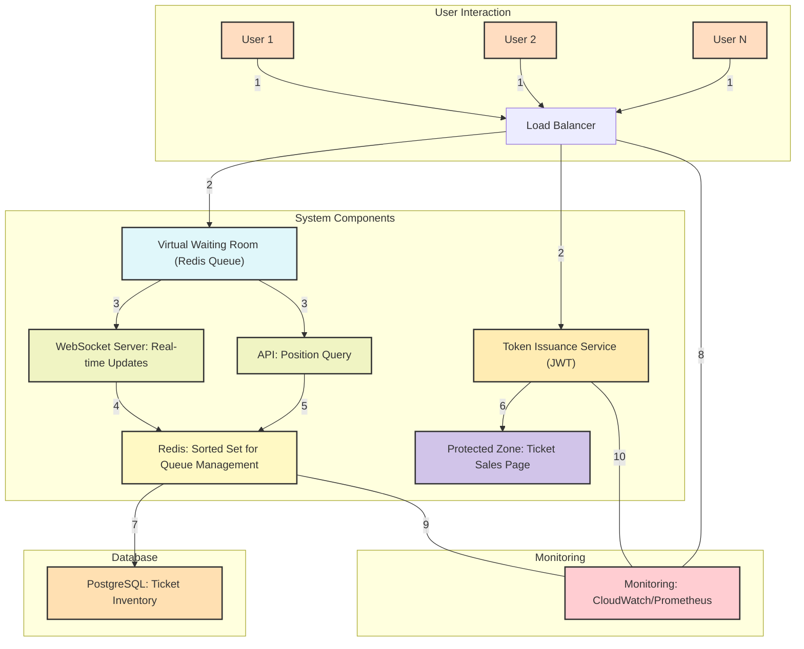
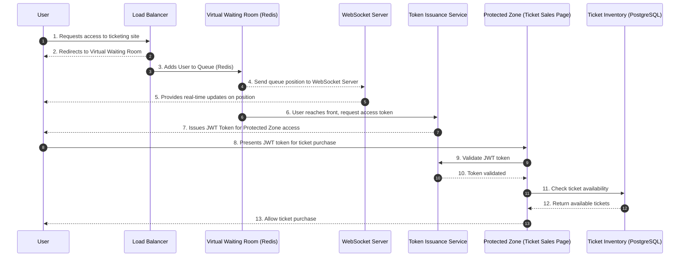

### Virtual Waiting Room: Detailed Design

The **Virtual Waiting Room** is a critical part of the system. Its purpose is to handle the high volume of users before the ticket sale begins and ensure only users who receive an access token can enter the **Protected Zone**. Below is a detailed breakdown of the waiting room's architecture, components, queue management, token issuance, and performance optimizations.

---

### Key Components of the Virtual Waiting Room:

1. **User Registration and Traffic Control**:
   - As soon as users visit the site, they are **redirected to the waiting room** rather than accessing the protected zone (ticketing system).
   - **WebSocket** or **long polling** communication channels provide real-time updates about their position in the queue.
   - **Rate limiting** and **bot protection** mechanisms (e.g., via AWS WAF or reCAPTCHA) prevent abuse and manage traffic effectively.

2. **Queue Management**:
   - Users are placed in a queue in the order they arrive.
   - **Redis Sorted Sets** are ideal for this because they can manage millions of users efficiently with low-latency reads/writes.
   - A **user's position** in the queue is maintained by assigning a **score** (e.g., a timestamp or sequence number) in the sorted set.
   - Users can check their current position and wait time by polling the system or via WebSockets for live updates.

3. **Token Issuance and Batching**:
   - When the ticket sale starts, the system **releases access tokens** to users in batches.
   - **JWT tokens** are generated and provided to the users at the front of the queue. These tokens carry limited-time access to the protected zone.
   - **Batch Size**: To avoid overwhelming the backend ticketing system, access tokens are issued in controlled batches, say 1,000 users every few seconds. The system must throttle this based on the backend's capacity.
   - **Fairness and Anti-bot Measures**: Token issuance should be fair, randomizing slightly within small groups to avoid users exploiting arrival times. CAPTCHA or other measures can help deter bots from hoarding positions in the queue.

4. **Position Tracking and User Session**:
   - Users are tracked in the queue using their **session or user ID** (possibly stored in a session cookie).
   - If a user disconnects (e.g., refreshes the page), their position in the queue remains unchanged. This is crucial for preventing users from losing their place.

5. **Real-time Updates**:
   - The **Redis Sorted Set** provides the ability to query a user's position in real-time.
   - WebSockets or long-polling techniques are used to send updates to users about their **position in the queue**, estimated wait time, and when they are approaching the front of the line.

6. **Queueing Strategy**:
   - **First-Come, First-Served** (FCFS) is the standard approach, but variations can include VIP access or priority users (handled via different Redis sets or adding priority scores to some users).
   - **Timeout Handling**: Users who stay idle for too long or disconnect for an extended time can be removed from the queue to free up space.
   - **Persistence**: To avoid data loss in the event of Redis failure, a backup (e.g., Redis persistence or a secondary persistent store) should be implemented to recover queue states.

---

### Detailed Workflow of the Virtual Waiting Room:

1. **User Arrival**:
   - User arrives at the website. Instead of directly accessing the ticketing system, they are placed into the **virtual waiting room**.
   - A **Redis Sorted Set** is used to record the user’s entry, with their **user ID** and a **timestamp** as the score.

2. **Position Calculation**:
   - Users in the waiting room are assigned a **position** based on their timestamp or assigned score in Redis.
   - Every few seconds, the system checks each user’s position to provide them with an updated wait time.

3. **Queue Updates**:
   - A WebSocket server sends real-time updates to each user, showing them their place in the queue and an estimated wait time.
   - If WebSocket is unavailable, users can poll via HTTP requests every 30-60 seconds to get updated information.

4. **Token Generation and Distribution**:
   - When the sale starts, tokens are generated for users at the front of the queue.
   - Tokens are in the form of **JWTs**, which contain:
     - User ID
     - Expiration time (to prevent reuse)
     - Signature to prevent tampering
   - Tokens are issued in **batches** (e.g., 1,000 users per batch), and each batch gets access to the protected zone with a valid token.

5. **Token Validation**:
   - Once a user has received an access token, they can enter the **protected zone** and attempt to purchase tickets.
   - The backend ticketing system verifies the token's validity, ensuring the user is authorized to proceed.

6. **Queue Draining**:
   - As users complete their transactions or leave, new users are allowed into the protected zone from the waiting room.
   - The system continues to issue tokens until either all tickets are sold or the queue is empty.

---

### Scalability Considerations:

1. **Redis for Queue Management**:
   - **Redis** is horizontally scalable, allowing it to handle millions of users in memory without performance degradation.
   - **Clustered Redis** (with automatic partitioning) can be used to distribute load across multiple Redis nodes to support large-scale traffic.
   - **Sorted Sets** are efficient for managing user queues and enable O(log(N)) time complexity for adding users and querying positions.

2. **Load Balancing and Traffic Control**:
   - **AWS Elastic Load Balancer (ELB)** or **NGINX** sits in front of the waiting room, distributing the incoming traffic evenly across servers.
   - The system should use **autoscaling** (e.g., AWS EC2 Auto Scaling) to spin up additional instances when load increases.

3. **Token Throttling**:
   - Issue tokens in small batches to avoid overwhelming the backend ticketing system.
   - For example, issuing tokens to 1,000 users every 5 seconds would help ensure the backend remains responsive.
   - If needed, the batch size can be dynamically adjusted based on real-time system load.

---

### Security and Resilience:

1. **Bot Prevention**:
   - Use **CAPTCHA** or **reCAPTCHA** to block bots from bypassing the waiting room.
   - Additional monitoring using tools like **Cloudflare Bot Management** can help detect and mitigate bot activity.

2. **Session Persistence and Failover**:
   - **Redis with persistence enabled** can ensure that the queue is not lost in case of a system crash.
   - A **backup queue** could be stored in a secondary database like **PostgreSQL** to recover users’ positions in the event of a major Redis failure.

3. **High Availability**:
   - Deploy the virtual waiting room in multiple availability zones to ensure high availability in case of regional failures.
   - **Redis replication** should be enabled to ensure there is no single point of failure in the queue management system.

---

### Performance Optimization:

1. **Caching**:
   - Use a **CDN** (Content Delivery Network) to cache static assets and reduce the load on backend services.
   - Cache the current position of users in the queue, so subsequent requests don’t always hit Redis directly.

2. **Request Throttling**:
   - Use rate limiting on requests, especially for position updates or polling, to prevent users from overwhelming the system with frequent requests.

3. **Horizontal Scaling**:
   - Both the **Redis** instance and the **WebSocket servers** should be designed to scale horizontally based on traffic. As the number of users grows, more Redis nodes and WebSocket servers can be added to handle the load.

---

### System Diagram: Focus on Virtual Waiting Room

```
   +---------------+         +------------------+        +-------------------+
   |    User        | ----->  |  Load Balancer   | -----> |   Virtual Waiting  |
   | (20M users)    |         |   (ELB/NGINX)    |        |     Room (Redis)   |
   +---------------+         +------------------+        +-------------------+
                                                              |
                                                              V
                                                +----------------------------+
                                                |    Token Management (JWT)   |
                                                +----------------------------+
                                                              |
                                                              V
                                                +----------------------------+
                                                |  Real-time Position Update  |
                                                |    (WebSocket/HTTP Poll)    |
                                                +----------------------------+
                                                              |
                                                              V
                                                +----------------------------+
                                                |   Access Token Validation   |
                                                |    (Issued when sale starts)|
                                                +----------------------------+
```

---

### Conclusion:

The **Virtual Waiting Room** is designed to efficiently manage millions of users, ensuring a smooth transition into the protected zone once the sale starts. By leveraging technologies like **Redis** for queue management, **WebSockets** for real-time updates, and **JWT tokens** for access control, the system can scale to handle heavy traffic while maintaining fairness and responsiveness.





